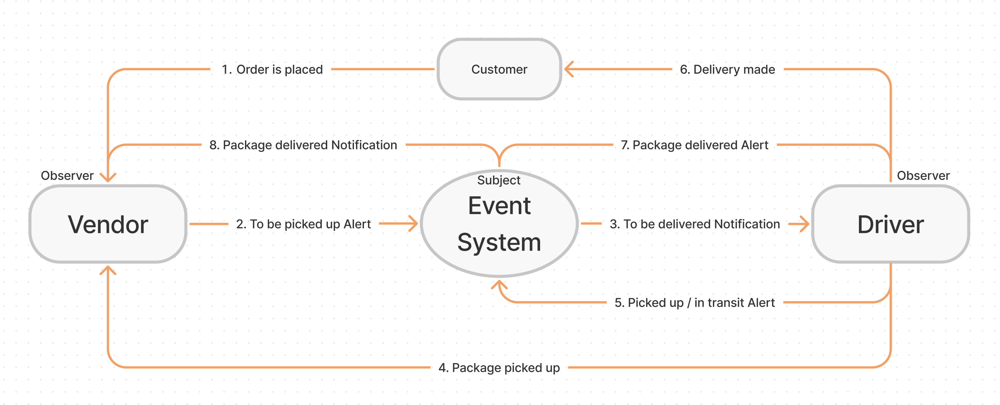

# CAPS (The Code Academy Parcel Service)

Created by Ryan Emmans

## Summary of Problem Domain

### **Phase 1 Requirements**

- As a vendor, I want to alert the system when I have a package to be picked up.
- As a driver, I want to be notified when there is a package to be delivered.
- As a driver, I want to alert the system when I have picked up a package and it is in transit.
- As a driver, I want to alert the system when a package has been delivered.
- As a vendor, I want to be notified when my package has been delivered.

And as developers, here are some of the development stories that are relevant to the above.

- As a developer, I want to use industry standards for managing the state of each package.
- As a developer, I want to create an event driven system so that I can write code that happens in response to events, in real time.

## Links to application deployment

- [Heroku Main Branch](https://ryanemmans-caps.herokuapp.com/)
- [GitHub Actions](https://github.com/ryanemmans/caps/actions)
- [Pull Requests](https://github.com/ryanemmans/caps/pulls?q=is%3Apr+is%3Aclosed)

## UML

## Technical Requirements / Notes

### Global Event Pool (HUB)

- Implement a Module for a Global Event Pool.
  - Export a single `EventEmitter` from the Node JS module.
  - Should be imported by any module that needs to notify or be alerted by other modules of an event.
- Implement a Module for Managing Global Package Events.
  - Listens to ALL events in the Event Pool.
  - Logs a timestamp and the payload of every event.

### Vendor Client Application

- Implement a Module for Managing Vendor Events.
  - Your implementation should use a `store name` as a parameter.
  - When run, the vendor module simulates a `pickup` event for the given `store name` to the Global Event Pool:
    - Emits `pickup` to the global event pool.
    - Emits a vendor order `payload`.
    - Listens for a `delivered` event and responds by logging a message to the console.

### Driver Client Application

- Implement a Module for Managing Driver Events.
  - Listens for a `pickup` event from the Global Event Pool and responds with the following:
    - Log a message to the console: `DRIVER: picked up <ORDER_ID>`.
    - Emit an ‘in-transit’ event to the Global Event Pool with the order payload.
    - Log a confirmation message to the console: `DRIVER: delivered <ORDER_ID>`.
    - Emit a ‘delivered` event to the Global Event Pool with the order payload.
